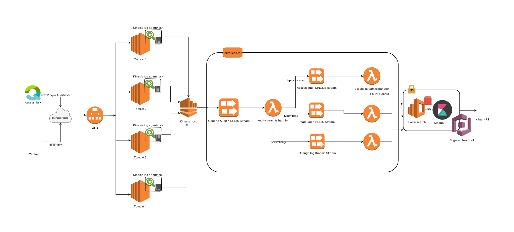

# Audit log processing with AWS Serverless and Kinesis streams

## Design



- Diagram prepped from [AWS Draw IO](https://www.draw.io/?splash=0&libs=aws3). Import the [audit log DrawIO XML](doc/arch.draw.io.xml) into the webapp.

### Assess
Assess sends the audit events collected over time , offline or online , over to Central through a sync process.

### Central
- Audit events are logged using Log4j to a file in each App server
- [Kinesis agent](https://github.com/awslabs/amazon-kinesis-agent) tails and sends the logs to a generic audit AWS Kinesis stream
- The Generic AWS Kinesis stream forwards to a specific Kinesis stream based on a type and partitions it
- The specific stream processes the payload and sends it over to AWS Elasticsearch under an Index
- Kibana is used to interrogate into these indices for events


## Local Setup

This is primarily for emulating the AWS Elastisearch, Kinesis and Lambda locally before deploying to AWS.

### Elasticsearch
Install from https://www.elastic.co/downloads. 
Once extracted, add the `bin` to path (bash_profile etc ) and test by running 
```sh
elasticsearch
```
Open a browser and go to http://localhost:9200 to check the status. 
Kill the elasticsearch server as this will be started using npm.

### Kibana

Install Kibana as documented in https://www.elastic.co/downloads. 

Once extracted, add the `bin` to path (bash_profile etc ) and test by running 
```sh
kibana
```
Open a browser and go to http://localhost:5601 to explore the UI. 
Kill the kibana server as this will be started using npm.


### Offline mode

Allow to run the system locally in offline mode.
`npm run offline`

This:
- Starts **Kinesis** using the kinesalite npm module to emulate kinesis
- Creates the required Kinesis streams for Audit log
- Starts a listener on to the above stream so as to invoke the handler
- Starts a demo http endpoint which can be used to test to insert an object into Kinesis
- Starts the kinesis agent watching log files. Look at `./kinesis-agent/agent.json`


### Test Publish to Kinesis

The kinesis agent in here tails `/tmp/choose-share/audit-kinesis-agent.log`. So if you pipe in the following json into a new line at the end, the agent picks it up and sends it to the generic Kinesis stream as configured in the **agent.json**. Note that the json should be a single line.

```json
{
    "type": "assess",
    "partitionKey": "US",
    "payload": {
        "events": [
            {
                "username": "mpaul",
                "userId": "A1000",
                "eventDate": "20181002T161932+0000",
                "eventType": "sometype1",
                "area": "area1",
                "clientId": "CL0001",
                "clientName": "Jane",
                "deviceId": "asads100",
                "deviceName": "ipAd",
                "entity": "Internal QA",
                "bu": "US BU",
                "offline": true,
                "changes": [
                    {
                            "fieldName": "fr",
                            "oldValue": "old",
                            "newValue": "new"
                    }
                ]
            },
            {
                "username": "upaulm2",
                "userId": "B1000",
                "eventDate": "20181011T161932+0000",
                "eventType": "sometype2",
                "area": "area2",
                "clientId": "CL0002",
                "clientName": "Joe",
                "deviceId": "asads200",
                "deviceName": "Android",
                "offline": false,
                "entity": "Internal QA1",
                "bu": "CA BU"
            }
        ]
    }
}
```

Typically I use the `groovysh` way as follows:-

```sh
groovysh

groovy:000> f = new File("/tmp/choose-share/audit-kinesis-agent.log")
groovy:000> f << {"type":"assess","partitionKey":"en-au","payload":{"events":[{"username":"mpaul","userId":"A1000","eventDate":1538664479412,"eventType":"sometype1","area":"area1","clientId":"CL0001","clientName":"Jane","deviceId":"asads100","deviceName":"ipAd","entity":"InternalQA","bu":"USBU","offline":true,"changes":[{"fieldName":"fr","oldValue":"old","newValue":"new"}]},{"username":"upaulm2","userId":"B1000","eventDate":1538664479412,"eventType":"sometype2","area":"area2","clientId":"CL0002","clientName":"Joe","deviceId":"asads200","deviceName":"Android","offline":false,"entity":"Internal QA1","bu":"CA BU"}]}}

```
### Unit tests

`npm test`

## AWS Deployment

### Pre-requisites
An Elasticsearch and Kibana UI needs to be setup preferable with proper access privileges and domain names, for eg http://kibana.<qiactive/qidevteam>.com etc. 

(Note this can be part of the serverless deployment so that this automatically created as part of stack creation process). This only needs to be added to the `resources` section of the `serverless.yml`

### Setup
Obtain the aws credentials, the access and secret key
- AWS access keys and secret keys as env variables setup either in `~/.aws/credentials` using `aws configure` commands
- All deploy commands can also be done by providing env variables as `aws_access_key_id=somekey aws_secret_access_key=xxxx npm run <deploy_method>`

### First time
`npm run deploy` deploys to AWS with the **dev** stage
`npm run deploy:prod` deploys to AWS with **prod** stage

These commands at the moment, creates:
- Generic Audit Kinesis Stream with the name <stage>-qi-audit-audit-stream, for eg prod it will be `prod-qi-audit-audit-stream`
- Assess Audit Kinesis Stream with the name <stage>-qi-audit-assess-log-stream.
- Uploads the  Generic stream λ handler function. See `audit-stream.ts`.
- Uploads the Assess stream λ handler function. See `assess-stream.ts`.

The λ functions that get uploaded are the TS transpiled JS with all the dependencies using imports and other configs in `webpack.config.js`

### Subsequent
This is when we need to update any logic in our processing source ( Lambda ). If the stack was previously created and if you want to re-deploy , call this in order
- `npm run remove` or `npm run remove:prod` for dev or prod
- `npm run deploy` or `npm run deploy:prod` for dev or prod


## Setting travis and coveralls badges
1. Sign in to [travis](https://travis-ci.org/) and activate the build for your project.
2. Sign in to [coveralls](https://coveralls.io/) and activate the build for your project.
3. Replace {{github-user-name}}/{{github-app-name}} with your repo details like: "gitrepo/project name".


## References 
 - Project created using [Yeoman TypeScript NodeJS Generator](https://github.com/ospatil/generator-node-typescript#readme)
 - Offline Kinesis inspired from http://blogs.lessthandot.com/index.php/enterprisedev/cloud/serverless-http-kinesis-lambdas-with-offline-development/
